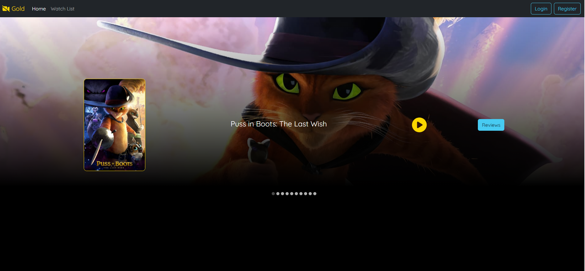
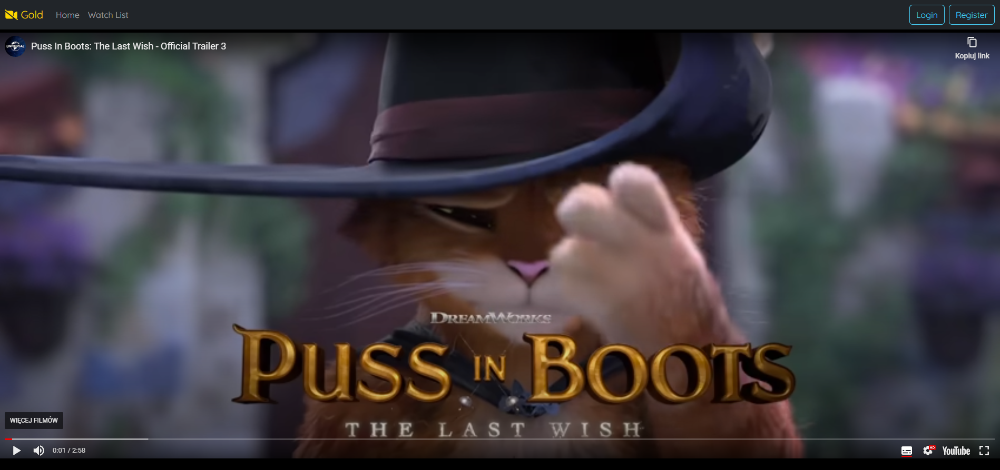
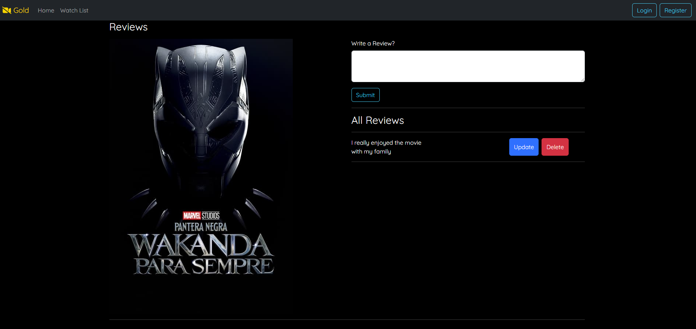

# Watch Movies Web App Documentation

## Overview

Welcome to the Watch Movies Web App documentation! This application is designed to showcase a collection of movies where users can explore trailers and leave their opinions. The frontend is built using JavaScript with the React library, while the backend is powered by Java with the Spring Boot framework. The data is stored in a MongoDB database.

## Table of Contents
1. [Getting Started](#getting-started)
  * [Prerequisites](#prerequisites)
  * [Installation](#installation)
2. [Project Structure](#project-structure)
  * [Frontend](#frontend)
  * [Backend](#backend)
  * [Database](#database)
3. [Configuration](#configuration)
  * [Frontend Configuration](#frontend-configuration)
  * [Backend Configuration](#backend-configuration)
  * [Database Configuration](#database-configuration)
4. [Usage](#usage)
  * [Running the Application](#running-the-application)
  * [Exploring Movies](#exploring-movies)
  * [Trailers](#trailers)
  * [Leaving Opinions](#leaving-opinions)

## Getting Started
 ## Prerequisites
Make sure you have the following installed:

* Node.js and npm (for frontend)
* Java Development Kit (JDK)
* MongoDB

 ## Installation
  ### Frontend
  cd movie 
  npm install

  ### Backend
  Import the project from my other repository [movies-backend](https://github.com/KrystianSzychx/movies-backend) into your favorite Java IDE and resolve dependencies.

  ### Database
  MongoDB is used to store movie data. Import data from the [_data](https://github.com/KrystianSzychx/movies-backend/tree/main/_data) folder in the [movies-backend](https://github.com/KrystianSzychx/movies-backend) repository.

  ## Project Structure
  ### Frontend
  The frontend is built using React and organized as follows  
movie  
<pre> |-- src  
    |-- api  
    |-- components   
    |-- App.js   
    |-- index.js   </pre>

  ### Backend
 The backend is developed with Spring Boot, following this structure:  
backend  
<pre> |-- src  
    |-- main  
      |-- java   
        |-- com.example.movies  
          |-- config   
          |-- Movie   
          |-- MovieController   
          |-- MovieRepository   
          |-- MoviesApplication   
          |-- MovieService     
          |-- Review   
          |-- ReviewController   
          |-- ReviewRepository   
          |-- ReviewService    </pre>

  ### Database
  MongoDB is used to store movie and reviews data. Collections are organized base on movie and review details.

  ## Configuration
   ### Frontend Configuration
   * Update `movie/src/api/axiosConfig.js` with the appropriate backend API URL.

  ### Backend Configuration
  * Update `movies/src/main/resources/application.properties` with your MongoDB connection details.

  ### Database Configuration
  Ensure MongoDB is running on the default port. Import data from the [_data](https://github.com/KrystianSzychx/movies-backend/tree/main/_data) in the [movies-backend](https://github.com/KrystianSzychx/movies-backend) repository.

  ## Usage
  ### Runing the Application
  Start the backend Spring Boot application.
  Navigate to the `movies` directory and run `npm start` to launch the React development server.

  ### Importing Backend Project
  Import the [movies-backend](https://github.com/KrystianSzychx/movies-backend) project into your favorite Java IDE and resolve dependencies.

  ### Importing Database Data
  Ensure MongoDB is running. Import data from the [_data](https://github.com/KrystianSzychx/movies-backend/tree/main/_data) in the [movies-backend](https://github.com/KrystianSzychx/movies-backend) repository.

  ## Exploring Movies
  Visit the homepage to view available movies.
  

  ## Trailers
  Explore trailers by clicking on the play button. Trailers are sourced from external services.
  

  ## Leaving Opinions
  Users have the opportunity to leave a review for a movie by clicking on the "Reviews" button on the selected movie page.
  

## Acknowledgements
Give credit here.
- This project was inspired by freeCodeCamp.org
- This project was based on [this tutorial](https://www.example.com](https://www.youtube.com/watch?v=5PdEmeopJVQ&ab_channel=freeCodeCamp.org)https://www.youtube.com/watch?v=5PdEmeopJVQ&ab_channel=freeCodeCamp.org).
